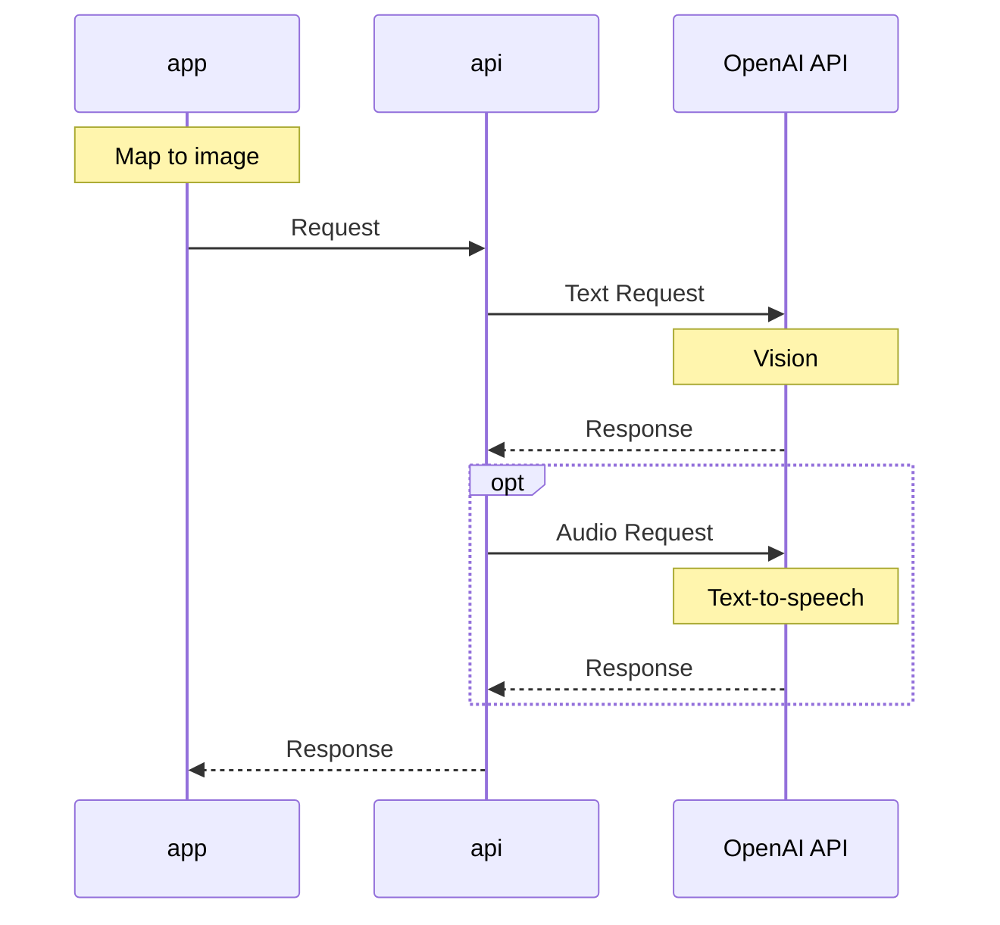

# map-to-speech-demo
An application showing map-to-speech method

## Sequence

The sequence diagram shows the intended flow of the map-to-speech method. The diagram shows actions between an app, api, and OpenAI API. When the app receives instructions to invoke the method, it converts the map to an image and sends it to the api. The api makes a request to the OpenAI API vision endpoint to receive a text description of the image. Optionally, the api may make a request to the OpenAI API text-to-speech endpoint to receive an audio description. Finally, the api responds to the app with the requested descriptions.

## Example Video (Loom):

https://www.loom.com/share/b4a609268d234cc58669ec38bd00df12?sid=d614cdd1-2e71-4fb7-aed1-649a6cea09df

The video shows two examples of adding text and speech descriptions to a web map. In each example, the user pans and zooms into an area of interest and then clicks on a button to fetch a voice and text description of the map view. After a few seconds, a text box at the bottom of the screen populates with a text description, and a voice begins reading the description out loud. The method is shown to work in both residential and rural areas.

## app

Find the app in `/app`.

Include your own:
- [Mapbox GL JS](https://docs.mapbox.com/mapbox-gl-js/api/) api key in [/app/index.js](https://github.com/sparkgeo/map-to-speech-demo/blob/main/app/index.js#L3)
- [api url](https://github.com/sparkgeo/map-to-speech-demo/blob/main/app/index.js#L1)

## api

Find the api in `/api`.

Set environment variables for:
- [OpenAI API](https://openai.com/blog/openai-api) key in [/api/main.py](https://github.com/sparkgeo/map-to-speech-demo/blob/main/api/main.py#L13)
- [allowed origins](https://github.com/sparkgeo/map-to-speech-demo/blob/main/api/main.py#L14)
