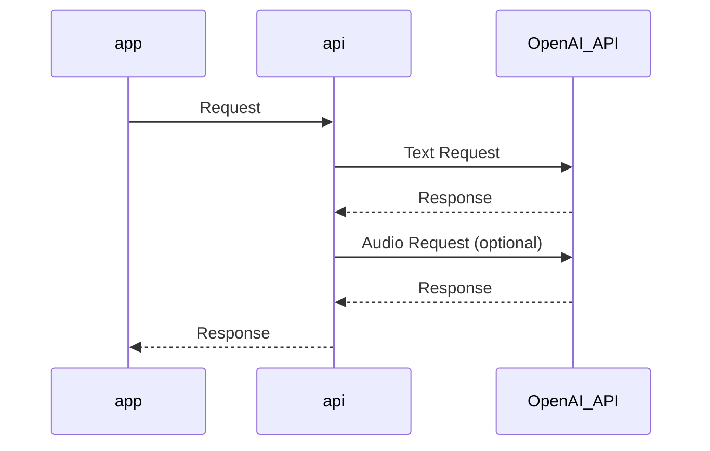

# map-to-speech-demo
An application showing map-to-speech method

Example Video (Loom):

https://www.loom.com/share/b4a609268d234cc58669ec38bd00df12?sid=d614cdd1-2e71-4fb7-aed1-649a6cea09df

## app

Find the app in `/app`.

Include your own:
- [Mapbox GL JS](https://docs.mapbox.com/mapbox-gl-js/api/) api key in [/app/index.js](https://github.com/sparkgeo/map-to-speech-demo/blob/main/app/index.js#L3)
- [api url](https://github.com/sparkgeo/map-to-speech-demo/blob/main/app/index.js#L1)

## api

Find the api in `/api`.

Set environment variables for:
- [OpenAI API](https://openai.com/blog/openai-api) key in [/api/main.py](https://github.com/sparkgeo/map-to-speech-demo/blob/main/api/main.py#L13)
- [allowed origins](https://github.com/sparkgeo/map-to-speech-demo/blob/main/api/main.py#L14)
